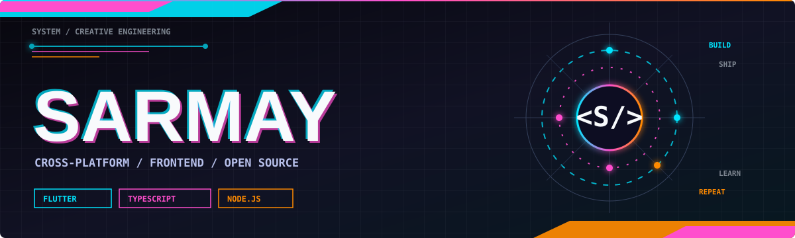

  

  

  
  
  

 

  <strong>Shipping cross-platform apps, frontend systems, and developer tools that solve real problems.</strong> 
  Build small. Ship often. Share what is reusable.

## ⚡ Current signal

<table>
  <tr>
    <td width="50%" valign="top">
      <h3>What I build</h3>
      <ul>
        <li>Cross-platform apps with Flutter and Dart</li>
        <li>Web services and tooling with TypeScript and Node.js</li>
        <li>Language, media, and workflow utilities</li>
      </ul>
    </td>
    <td width="50%" valign="top">
      <h3>What I care about</h3>
      <ul>
        <li>Products that stay useful after the demo</li>
        <li>Clear APIs and dependable integrations</li>
        <li>Open-source building blocks worth reusing</li>
      </ul>
    </td>
  </tr>
</table>

## 🧰 Toolbox

  

## 🚀 Project constellation

<table>
  <tr>
    <td width="50%" valign="top">
      <h3><a href="https://github.com/Sarmay/sarmay_player">sarmay_player</a></h3>
      
A Flutter media player built on <code>media_kit</code>.

      
      
    </td>
    <td width="50%" valign="top">
      <h3><a href="https://github.com/Sarmay/kazakh-script-converter">kazakh-script-converter</a></h3>
      
Lightweight Kazakh Arabic/Cyrillic conversion for web and Node.js.

      
      
    </td>
  </tr>
  <tr>
    <td width="50%" valign="top">
      <h3><a href="https://github.com/Sarmay/LiveStreamRecorder">LiveStreamRecorder</a></h3>
      
Practical tools for recording live streams.

      
      
    </td>
    <td width="50%" valign="top">
      <h3><a href="https://github.com/Sarmay/wechatpay-v3">wechatpay-v3</a></h3>
      
Node.js WeChat Pay v3 integration for NestJS.

      
      
    </td>
  </tr>
  <tr>
    <td width="50%" valign="top">
      <h3><a href="https://github.com/Sarmay/bob-plugin-deeplx">bob-plugin-deeplx</a></h3>
      
A Bob translation plugin powered by DeepLX.

      
      
    </td>
    <td width="50%" valign="top">
      <h3><a href="https://github.com/Sarmay/wxcloud">wxcloud</a></h3>
      
A local Docker extension for Weixin Cloudbase.

      
      
    </td>
  </tr>
</table>

## 📈 Public pulse

  

  

  These cards use public GitHub activity. GitHub's native profile remains the source of truth for private contributions.

## 🐍 Contribution stream

  <picture>
    <source media="(prefers-color-scheme: dark)" srcset="https://raw.githubusercontent.com/Sarmay/Sarmay/output/github-contribution-grid-snake-dark.svg" />
    <source media="(prefers-color-scheme: light)" srcset="https://raw.githubusercontent.com/Sarmay/Sarmay/output/github-contribution-grid-snake.svg" />
    
  </picture>

## 📡 Connect

  
  

  

